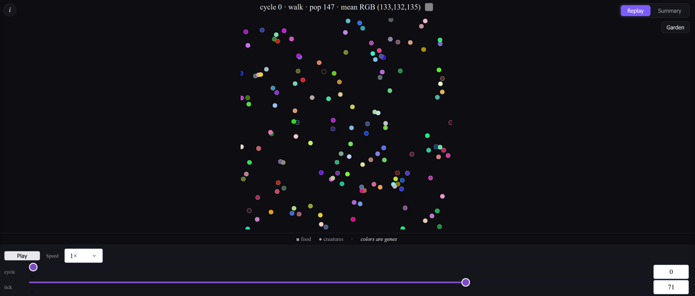
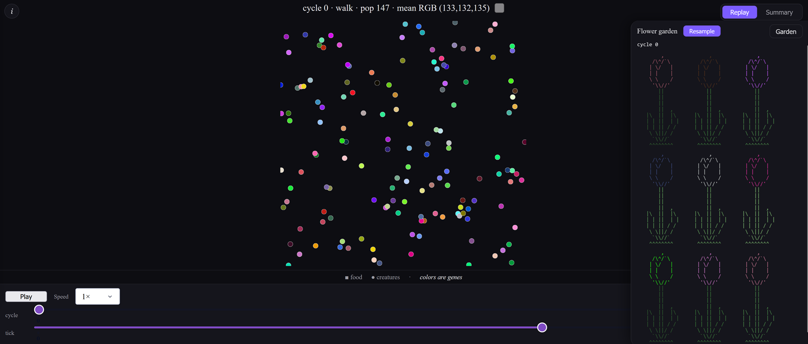
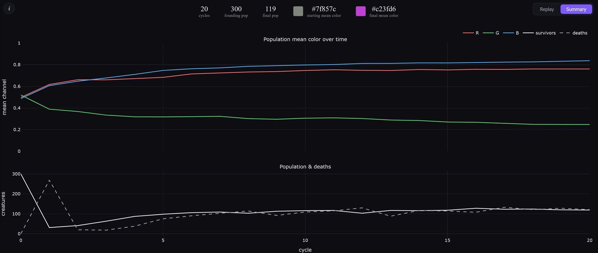

```
  _____   _____ ____    ______          _       _   _         __      ___
 |  __ \ / ____|  _ \  |  ____|        | |     | | (_)        \ \    / (_)
 | |__) | |  __| |_) | | |____   _____ | |_   _| |_ _  ___  _ _\ \  / / _  _____      _____ _ __
 |  _  /| | |_ |  _ <  |  __\ \ / / _ \| | | | | __| |/ _ \| '_ \ \/ / | |/ _ \ \ /\ / / _ \ '__|
 | | \ \| |__| | |_) | | |___\ V / (_) | | |_| | |_| | (_) | | | \  /  | |  __/\ V  V /  __/ |
 |_|  \_\\_____|____/  |______\_/ \___/|_|\__,_|\__|_|\___/|_| |_|\/   |_|\___| \_/\_/ \___|_|
```

A sandbox for **watching natural selection happen, in color**. `rgb_evo_view` is a
teaching-oriented evolution simulator in which **a creature's color *is* its
genome** — each creature is a dot whose entire heritable identity is one RGB value.
That makes selection something you *see* rather than read off a chart: a population
reorganizes its palette, generation by generation, in response to its environment.

You set up the world and the selection pressure — what food exists, how a creature's
color maps to the energy it can extract, how creatures move, and how they pair and
breed — then watch the population adapt over a series of cycles. The tool is the
point: change the rules and you get a different evolutionary story to watch unfold.

## See it run

Below is one configuration. Every dot is a creature painted with its own genome and
every small square is a food item. The founders start as a random spray of colors,
but only creatures whose color is a good match for the food can pull enough energy
from it to survive and reproduce — so each cycle the cloud shifts toward the colors
the environment rewards. The closing panel traces the population's mean R/G/B over
the whole run.


This is the bundled demo ([`simulation_configs/default.toml`](simulation_configs/default.toml));
it's just one point in the configuration space, included to show the tool in motion.

## How a cycle works

Each cycle has three phases, repeated for the length of the run:

1. **Food** — colored food resources are scattered across the world (static for the
   cycle).
2. **Walk** — creatures wander for a fixed number of ticks, spending one energy per
   tick. Bumping into food yields energy *proportional to how well the creature's
   color matches the food's color*. Run out of energy and you die.
3. **Mate** — the survivors pair with their nearest neighbor and produce offspring
   whose color is the average of the parents' (plus optional mutation).

What "matches" means, how harshly a mismatch is punished, how creatures move, how
they pair, and whether energy carries across cycles are all knobs — see
[Configuration](#configuration). See [`implementation_plan.md`](implementation_plan.md)
for the full design, including the four energy-overlap models and the
population-dynamics trade-offs.

---

## Installation

```bash
poetry install                 # requires Python 3.13+
poetry run pre-commit install  # optional: enable the git hooks
```

## Running

```bash
poetry run python runner.py --gif out.gif   # render the run to an animated GIF
poetry run python runner.py --headless      # no window; just write history + a stats plot
poetry run python runner.py my_config.toml --gif out.gif --cycles 200 --seed 7
```

A run must choose a mode: `--gif` or `--headless`; a bare `python runner.py`
exits with a pointer to those flags. There's no live windowed viewer — to poke
at a finished run interactively, use the browser viewer described in
[Explore a run in your browser](#explore-a-run-in-your-browser).

Each run writes a timestamped folder under `runs/` containing a copy of the
config, a per-cycle `history.json`, a `history.png` summary plot, and `frames.npz`
(the full per-tick geometry).

### Rebuilding an animation without re-running

Because every run saves `frames.npz`, you can re-render its GIF with different
animation settings — timing, frame budget, hold lengths — in seconds, without
paying for the simulation again:

```bash
poetry run python build_animation.py runs/<timestamp>             # -> run_animations/<timestamp>.gif
poetry run python build_animation.py runs/<timestamp> --fps 15 --max-frames 800
```

Rebuilt GIFs are written under `run_animations/`.

## Explore a run in your browser

A GIF is a fixed recording. For a closer look, any finished run can be opened in
an interactive web viewer that **replays the frames the run already saved** — no
re-simulation. Point it at a run folder, or leave it off to grab the most recent:

```bash
poetry run python -m visualizer.interactive               # newest run under runs/
poetry run python -m visualizer.interactive runs/<timestamp> --port 8060
```

Then open the address it prints in your browser.

**Replay the world.** Scrub through the run with the cycle and tick sliders, or
press Play to watch it unfold. Squares are food, circles are creatures, and every
dot is painted with its own genome. New to it? The "i" in the top-left pops open a
plain-language explainer of what you're looking at.



**See the population as a garden.** A slide-out panel draws a sample of the living
creatures as ASCII flowers, each tinted by its genome — another way to feel the
palette shift as selection runs, and to spot when the population has converged on
a color.



**Read the whole run at a glance.** The Summary tab charts how the population's
mean red, green, and blue drifted across every cycle — alongside survivors and
deaths — with swatches of the starting and final mean color so you can see at a
glance where evolution took the palette.



## Configuration

A run is fully described by one TOML file; copy and edit
[`simulation_configs/default.toml`](simulation_configs/default.toml), which is
heavily commented. The knobs are where the different evolutionary scenarios live:

- **Food** — the colors, distribution, and energy value of what's on offer. This
  *is* the environment; it defines what the population is selected toward.
- **Energy overlap model** — how a color match maps to extractable energy (four
  models, from a forgiving projection to one that punishes any off-target pigment),
  plus a `gamma` that sharpens or softens selection.
- **Locomotion** — how creatures move (`brownian`, `inertial`).
- **Founding population & mating** — starting colors, how partners pair, mutation.
- **Energy** — per-cycle budget, movement cost, and whether survivors carry energy
  forward (see below).

> **Tuning note:** keep `starting_energy` *below* `steps_per_cycle` — otherwise no
> creature ever starves, selection switches off, and (with `parents_survive`) the
> population grows without bound.
>
> **Carryover:** with `energy.carryover_energy` (on by default), `starting_energy`
> is only the *initial* budget for new creatures; survivors keep their leftover
> across cycles instead of resetting. This sharpens selection over the run and
> only takes effect with `parents_survive = true`.

## Development

```bash
poetry run pytest                       # run the test suite
poetry run ruff check . && poetry run ruff format .
poetry run bash scripts/generate_api_docs.sh   # regenerate docs/api from docstrings
```
